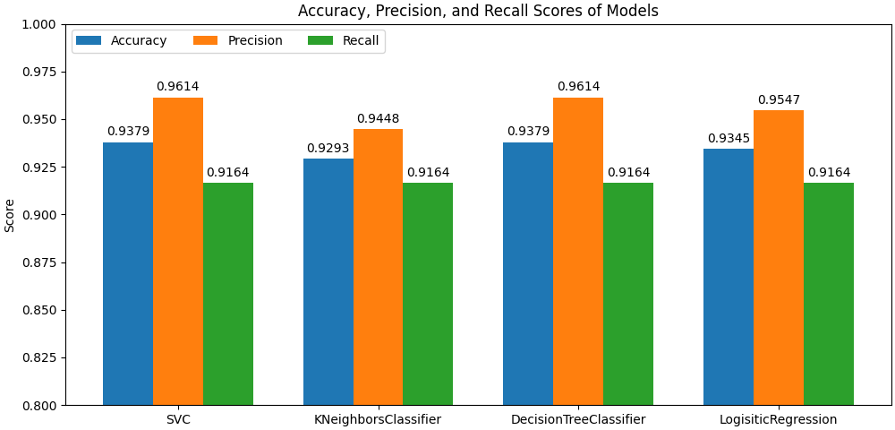

# Introvert/Extrovert Dataset Analysis and Model Prediction

## Overview

This repo contains my analysis of Rakesh Kapilavayi's [Extrovert vs. Introvert Behavior Data](https://www.kaggle.com/datasets/rakeshkapilavai/extrovert-vs-introvert-behavior-data) dataset from Kaggle. This dataset compiles data from a survey where respondants were asked questions about their social life and whether they consider themselves as extroverted or introverted. My goal is develop models that could predict whether a person is an extrovert or an introvert.

My analysis started with looking at each column in the table and identifying how they correlate to someone being either an extrovert or an introvert. Afterwards, I trained 4 models (an SVC, a KNeighborsClassifier, a DecisionTreeClassifier, and a LogisticRegression model) to predict, given facts about a person's social life, whether someone was an extrovert or an introvert.

My work has shown that the dataset indicates that there are clear differences between the social lives of introverts and extroverts. Additionally, the model's I trained performed very similarly to each other, with an SVC and DecisionTreeClassifier barely scraping by as the top performers of the dataset in terms of accuracy, precision, and recall in the testing set.

## Contents
- `RawData`: Folder containing the original dataset
- `data_analysis.ipynb`: Jupyter Notebook containing my data analysis
- `requirements.txt`: Text file with the necessary python imports

## Final Results

